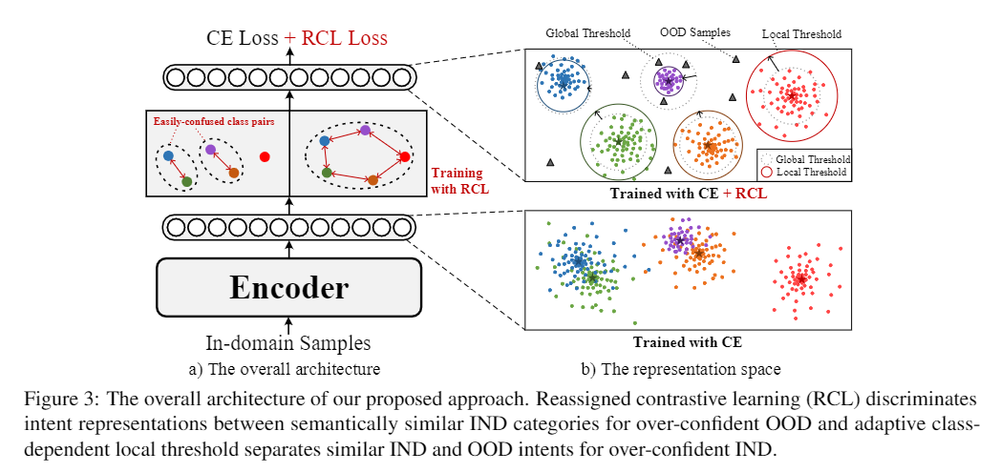

# Revisit Overconfidence for OOD Detection: Reassigned Contrastive Learning with Adaptive Class-dependent Threshold


This repository is the official implementation of Revisit Overconfidence for OOD Detection: [Reassigned Contrastive Learning with Adaptive Class-dependent Thresholde](https://aclanthology.org/2022.naacl-main.307/) **(NAACL2022)** by [Yanan Wu](https://aclanthology.org/people/y/yanan-wu/), [Keqing He](https://aclanthology.org/people/k/keqing-he/), [Yuanmeng Yan](https://aclanthology.org/people/y/yuanmeng-yan/), [Qixiang Gao](https://aclanthology.org/people/q/qixiang-gao/), [Zhiyuan Zeng](https://aclanthology.org/people/z/zhiyuan-zeng/), [Fujia Zheng](https://aclanthology.org/people/f/fujia-zheng/), [Lulu Zhao](https://aclanthology.org/people/l/lulu-zhao/), [Huixing Jiang](https://aclanthology.org/people/h/huixing-jiang/), [Wei Wu](https://aclanthology.org/people/w/wei-wu/), [Weiran Xu](https://aclanthology.org/people/w/weiran-xu/).


# Introduction

An OOD detection model based on reassigned contrastive learning with adaptive class-dependent threshold.

The architecture of the proposed model:



An example of confused label pair:


# Dependencies

We use anaconda to create python environment:

`conda create --name python=3.6`

Install all required libraries:

`pip install -r requirements.txt`

# How to run

1. Baseline : Cross-entropy Loss  
```sh run.sh 0```


2. Baseline : Supervised contrastive loss  
 ``sh run.sh 1``

3. Reassigned Contrastive Learning  
`sh run.sh 2`

# Parameters

The parameters that must be specified:

- `dataset`, required, The dataset to use, CLINC_OOD_full, ATIS, SNIPS... 
- `mode`, optional, specify running mode, options: 
    - `train`: only train model
    - `test`: only predict the model with trained model
    - `both`: train model, and use the trained model to predict
- `detect_method`, required when the mode is 'test' or 'both', specify the settings to detect ood samples, options:
    - `msp`: using MSP for predicting
    - `lof`: using LOF for predicting
    - `gdaeucli`: using GDA for predicting, using lsqr for solver, and the threshold is 800 (Mahalanobis distance)
    - `gdamaha`: using GDA for predicting, using lsqr for solver, and the threshold is automatically inferred from the training data
    - `energylocal`: using energy for predicting
    - `msplocal`: using LOF for predicting with adaptive class-dependent threshold
    - `gdaeucli_local`:  using GDA for predicting, using lsqr for solver, and the threshold is 800 (Mahalanobis distance)
    - `gdamaha_local`: using GDA for predicting, using lsqr for solver, and the threshold is automatically inferred from the training data
    - `energylocal`: using energy for predicting with adaptive class-dependent threshold
- `model_dir`, required when the mode is 'test', specify the directory contains model file 
- `unseen_classes`, oos
- `confused_pre_epoches`, default=5
- `global_pre_epoches`, default=25
- `ce_pre_epoches`, default=30

The parameters that have default values (In general, it can stay fixed):

- `gpu_device`, default = 1
- `output_dir`, default = ./outputs
- `embedding_file`, default = /glove/glove.6B.300d.txt
- `embedding_dim`, default = 300
- `max_seq_len`, default = None,
- `max_num_words`, default = 10000
- `max_epoches`, default = 200
- `patience`, default = 20
- `batch_size`, default = 200
- `seed`, default = 2022
- `T`, default = 1
- `train_class_num`, default = n 

# Code Introduction by block 

## 1. model.py

- BiLSTM_LMCL main model
- LMCL Loss
- SCL Loss
- RCL Loss

## 2. train.py

Model main experiment, including:

- Process Data
- Select OOD type randomly or specify OOD type
- Train model(BiLSTM + LSTM)
    - CE
    - SCL
    - RCL
- Predict model
    - msp
    - lof
    - gdaeucli
    - gdamaha
    - energy
    - msplocal
    - loflocal
    - gdaeucli_local
    - gdamaha_local
    - energylocal
    

## 3. utils.py

- **get_score**, get f1, f1_seen, f1_unseen result according to the confusion matrix
- **plot_confusion_matrix**, print and plot confusion matrix
- **confidence**, calculate mahalanobis or euclidean distance based on the confidence of each category
- **get_test_info**, get predicting results including text,label,softmax probability, softmax prediction,softmax confidence,(if use lof) lof prediction result,(if use gda) gda mahalanobis distance, (if use gda) the gda confidence
- **estimate_best_threshold**, automatically calculate the optimal threshold on the validation set
- **pca_visualization**, draw feature PCA visualization (examle:./make_figures/figures/pca.png)
- **single_class_pca**, compare euclidean and mahalanobis distances using PCA visualization (example:./make_figures/figures/distance_vs.png)
- **log_pred_results**, Read'. / output_dir... /result.txt' file, print the result in the specified format, and convert it to the 'results.json' file.

# Results

<table>
       <tr  align="center">
        <td><b></b></td>
        <td><b></b></td>
        <td colspan="6"><b>CLINC-Full</b></td>
        <td colspan="6"><b>Snips</b></td>
       </tr>
      <tr  align="center">
        <td><b></b></td>
        <td><b></b></td>
        <td colspan="3"><b>Global Threshold</b></td>
        <td colspan="3"><b>Local Threshold(ours)</b></td>
        <td colspan="3"><b>Global Threshold</b></td>
        <td colspan="3"><b>Local Threshold(ours)</b></td>
       </tr>   
       <tr  align="center">
        <td><b></b></td>
        <td><b></b></td>
        <td colspan="3"><b>OOD</b></td>
        <td colspan="3"><b>IND</b></td>
        <td colspan="3"><b>OOD</b></td>
        <td colspan="3"><b>IND</b></td>
       </tr>    
       <tr  align="center">
        <td><b></b></td>
        <td><b></b></td>
        <td colspan="2"><b>F1</b></td>
        <td colspan="2"><b>Recall</b></td>
        <td colspan="2"><b>F1</b></td>
        <td colspan="2"><b>Recall</b></td>
        <td colspan="2"><b>F1</b></td>
        <td colspan="2"><b>Recall</b></td>
       </tr>   
      <tr  align="center">
            <td>MSP</td>
            <td>CE</td>                
            <td>54.70</td>
            <td>44.50 </td>
            <td>86.28 </td>
            <td>64.35 </td>
            <td>62.00 </td>
            <td>87.06 </td>
            <td>74.39 </td>
            <td>80.19 </td>
            <td>88.37 </td>
            <td>78.03 </td>
            <td>82.46  </td>
            <td>90.21 </td>
        </tr>    
      <tr  align="center">
            <td>MSP</td>
            <td>SCL</td>                
            <td>56.98 </td>
            <td>46.34 </td>
            <td>87.94 </td>
            <td>65.88 </td>
            <td>64.31 </td>
            <td>88.00 </td>
            <td>80.57 </td>
            <td>89.60 </td>
            <td>79.25 </td>
            <td>78.03 </td>
            <td>82.57  </td>
            <td>91.30 </td>
        </tr>
        <tr  align="center">
            <td>MSP</td>
            <td>RCL(ours)</td>                
            <td><b>61.71</b> </td>
            <td><b>53.90</b> </td>
            <td>88.45 </td>
            <td><b>67.43</b> </td>
            <td><b>64.92</b> </td>
            <td>88.76 </td>
            <td><b>81.00 </b></td>
            <td><b>81.52 </b></td>
            <td>91.71 </td>
            <td><b>83.53</b> </td>
            <td><b>82.94</b>  </td>
            <td>93.28 </td>
        </tr>   
        <tr  align="center">
            <td>GDA</td>
            <td>CE</td>                
            <td>65.79 </td>
            <td>64.14 </td>
            <td>87.90 </td>
            <td>68.06 </td>
            <td>73.50 </td>
            <td>87.95 </td>
            <td>77.33 </td>
            <td>79.23 </td>
            <td>90.08 </td>
            <td>81.96 </td>
            <td>84.52  </td>
            <td>90.11 </td>
        </tr>    
        <tr  align="center">
            <td>GDA</td>
            <td>SCL</td>                
            <td>68.04 </td>
            <td>66.92 </td>
            <td>88.60 </td>
            <td>70.85 </td>
            <td>73.40 </td>
            <td>88.63 </td>
            <td>80.27 </td>
            <td>82.46 </td>
            <td>91.19 </td>
            <td>83.45 </td>
            <td>87.20  </td>
            <td>92.58 </td>
        </tr>   
        <tr  align="center">
            <td>GDA</td>
            <td>RCL(ours)</td>                
            <td><b>72.61</b> </td>
            <td><b>70.00</b> </td>
            <td>88.98 </td>
            <td><b>73.88</b> </td>
            <td><b>75.10</b> </td>
            <td>89.03 </td>
            <td><b>85.24</b> </td>
            <td><b>86.95</b> </td>
            <td>93.89 </td>
            <td><b>87.91</b> </td>
            <td><b>88.57</b>  </td>
            <td>94.65 </td>
        </tr>   
        <tr  align="center">
            <td>Energy</td>
            <td>CE</td>                
            <td>68.87 </td>
            <td>66.30 </td>
            <td>88.02 </td>
            <td>71.67 </td>
            <td>72.50 </td>
            <td>88.78 </td>
            <td>78.75 </td>
            <td>79.27 </td>
            <td>91.00 </td>
            <td>82.65 </td>
            <td>84.70  </td>
            <td>92.58 </td>
        </tr>
        <tr  align="center">
            <td>Energy</td>
            <td>SCP</td>                
            <td>71.12 </td>
            <td>71.01 </td>
            <td>88.59 </td>
            <td>73.15 </td>
            <td>73.20 </td>
            <td>88.98 </td>
            <td>81.72 </td>
            <td>81.99 </td>
            <td>91.27 </td>
            <td>85.04 </td>
            <td>85.83  </td>
            <td>95.42 </td>
        </tr>
        <tr  align="center">
            <td>Energy</td>
            <td>SCP</td>                
            <td><b>74.30</b> </td>
            <td><b>72.03</b> </td>
            <td>89.56 </td>
            <td><b>75.32</b> </td>
            <td><b>78.60</b> </td>
            <td>89.67 </td>
            <td><b>86.41</b> </td>
            <td><b>87.16</b> </td>
            <td>94.40 </td>
            <td><b>89.21</b> </td>
            <td><b>89.45</b>  </td>
            <td>95.42 </td>
        </tr>
</table>


# Citation

```
@inproceedings{wu-etal-2022-revisit, 
    title = "Revisit Overconfidence for {OOD} Detection: Reassigned Contrastive Learning with Adaptive Class-dependent Threshold", 
    author = "Wu, Yanan  and
      He, Keqing  and
      Yan, Yuanmeng  and
      Gao, QiXiang  and
      Zeng, Zhiyuan  and
      Zheng, Fujia  and
      Zhao, Lulu  and
      Jiang, Huixing  and
      Wu, Wei  and
      Xu, Weiran",
    booktitle = "Proceedings of the 2022 Conference of the North American Chapter of the Association for Computational Linguistics: Human Language Technologies",
    month = jul,
    year = "2022",
    address = "Seattle, United States",
    publisher = "Association for Computational Linguistics",
    url = "https://aclanthology.org/2022.naacl-main.307",
    doi = "10.18653/v1/2022.naacl-main.307",
    pages = "4165--4179",
    abstract = "Detecting Out-of-Domain (OOD) or unknown intents from user queries is essential in a task-oriented dialog system. A key challenge of OOD detection is the overconfidence of neural models. In this paper, we comprehensively analyze overconfidence and classify it into two perspectives: over-confident OOD and in-domain (IND). Then according to intrinsic reasons, we respectively propose a novel reassigned contrastive learning (RCL) to discriminate IND intents for over-confident OOD and an adaptive class-dependent local threshold mechanism to separate similar IND and OOD intents for over-confident IND. Experiments and analyses show the effectiveness of our proposed method for both aspects of overconfidence issues.",
}
```
